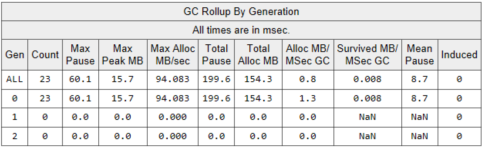
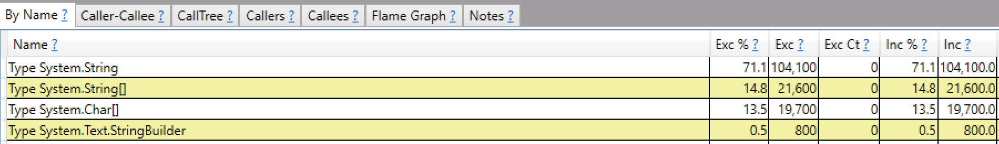
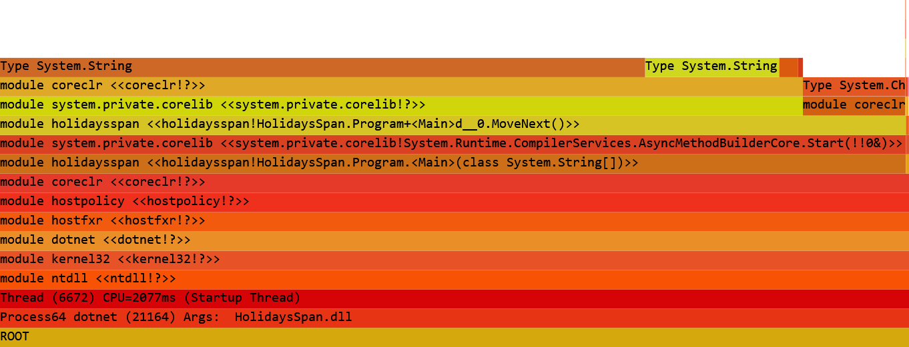
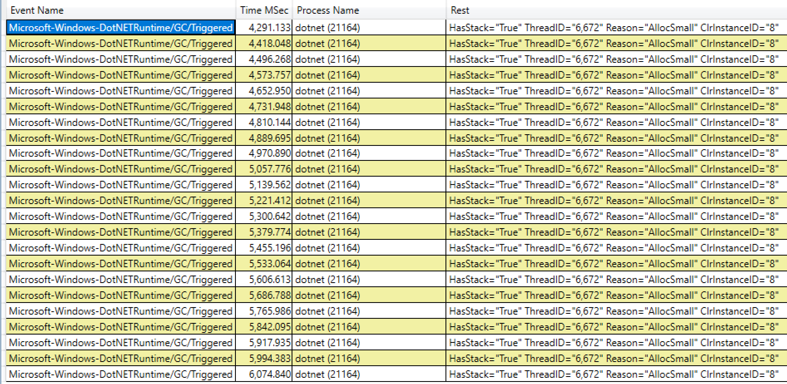
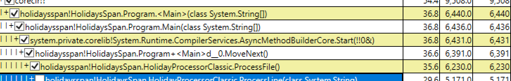
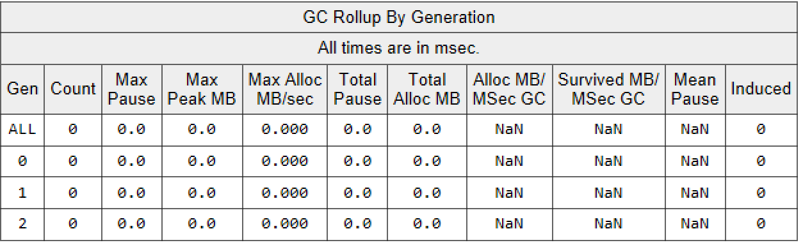
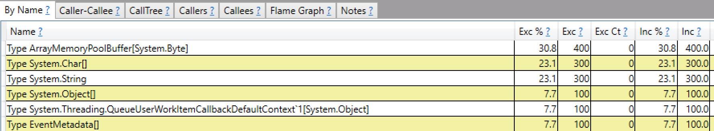
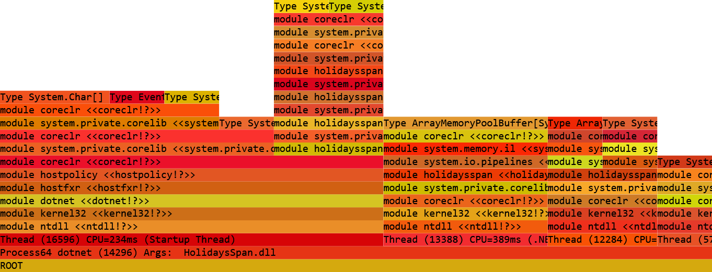
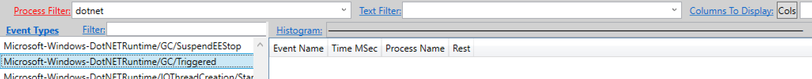

# The power of Span #

### Intro to the problem ###

In one organization, I had to schedule a regular meeting once a week, that fits most the people. Fortunately, the people in this organization mark their holidays in a csv file, so processing the file can help me to figure the day when the least favorable for holidays.
For this I would like to have a table which shows the given weekday, and the number of holidays taken on that day.

> As a note, we can assume people include public holidays to the time interval in the file, as they usually do so. They also include Saturdays and Sundays too, but those will be filtered out.

Fortunately, we can have two solutions for this problem. On is the classic solution in the 'old' C# way, and one new solution from the ```Span``` era of dotnet with a more efficient solution.

> What does efficient mean? I will focus on CPU usage and heap allocations.

The csv file mostly looks as follows:

```csv
name, start day, end day
```

A real example is (usually, no header included). The file used for the actual performance testing will a lot bigger, in the size of 14 MB.

```
Laszlo,25/06/2019,28/06/2019
Peter,30/07/2019,07/08/2019
Lisa,22/05/2019,28/05/2019
Jeff,22/04/2019,20/05/2019
Scott,11/05/2019,11/05/2019
Scott,18/05/2019,20/05/2019
Peter,15/09/2019,19/05/2019
Andrea,17/03/2019,20/03/2019
Lisa,18/06/2019,30/06/2019
Gabor,01/07/2019,11/07/2019
Peter,08/09/2019,17/09/2019
Scott,07/10/2019,12/10/2019
Laura,24/10/2019,04/11/2019
Andrea,08/05/2019,19/05/2019
Laura,27/07/2019,05/08/2019
```

### The classic solution ###

Using ```string.Split```. Note for the sake of the demostrations, I will not boder with malformatted files, exceptions and error handling. We can assume ever line is correct, complete and parsable to the required formats.

```csharp
public class HolidayProcessorClassic
{
  private Dictionary<DayOfWeek, int> _days = new Dictionary<DayOfWeek, int>();
  public void Run()
  {
    ProcessFile();
    PrintResult();
  }

  private void ProcessFile()
  {
    using (var file = File.Open("holidays.csv", FileMode.Open, FileAccess.Read, FileShare.Read))
    {
      using (var reader = new StreamReader(file))
      {
        string line;
        while ((line = reader.ReadLine()) != null)
        {
          ProcessLine(line);
        }
      }
    }
  }

  private void ProcessLine(string line)
  {
    var parts = line.Split(new[] { ',' }, StringSplitOptions.RemoveEmptyEntries);
    DateTime startDate = ParseDate(parts[parts.Length - 2]);
    DateTime endDate = ParseDate(parts[parts.Length - 1]);
    ProcessDates(startDate, endDate);
  }

  private DateTime ParseDate(string date)
  {
    return DateTime.ParseExact(date, "dd/MM/yyyy", CultureInfo.InvariantCulture);
  }

  private void ProcessDates(DateTime startDate, DateTime endDate)
  {
    while (startDate.Date <= endDate.Date)
    {
      if (startDate.Date.DayOfWeek != DayOfWeek.Saturday || startDate.Date.DayOfWeek != DayOfWeek.Sunday)
        if (!_days.TryAdd(startDate.Date.DayOfWeek, 1))
          _days[startDate.Date.DayOfWeek]++;
      startDate = startDate.AddDays(1);
    }
  }

  private void PrintResult()
  {
    foreach (var entry in _days)
    {
      Console.WriteLine($"{entry.Key}: {entry.Value}");
    }
  }
}
```

All above should look pretty familiar. The code will be invoked through the only public ```Run()``` method. It will do 2 things: process the file in question and print the results on the console. The ```ProcessFile``` method opens the file, reads it line-by-line and calls ```ProcessLine```. Each line is processed by splitting it by commas, taking the two date columns and parsing the string to actual DateTime structs. ```ProcessDates``` iterates over the time interval and increments a counter for each day in the ```_days``` dictionary.
Finally, ```PrintResults``` iterates over the entries of the dictionary and writes the values to the console.

In the next section I will incrementally refactor the above code to a more efficient solution using ```Span<T>```.

### Step 1 - days dictionary

```_days``` dictionary. We know the maximum capacity upfront. We also know all the possible entries. Let's add them:

```csharp
private readonly Dictionary<DayOfWeek, int> _days = new Dictionary<DayOfWeek, int>(5);
public HolidayProcessor()
{
  _days.Add(DayOfWeek.Monday, 0);
  _days.Add(DayOfWeek.Tuesday, 0);
  _days.Add(DayOfWeek.Wednesday, 0);
  _days.Add(DayOfWeek.Thursday, 0);
  _days.Add(DayOfWeek.Friday, 0);
}

private void ProcessDates(DateTime startDate, DateTime endDate)
{
  while (startDate.Date <= endDate.Date)
  {
    if (startDate.Date.DayOfWeek != DayOfWeek.Saturday && startDate.Date.DayOfWeek != DayOfWeek.Sunday)
      _days[startDate.Date.DayOfWeek]++;
    startDate = startDate.AddDays(1);
  }
}

private void PrintResult()
{
  StringBuilder sb = new StringBuilder();
  foreach (var entry in _days)
  {
    sb.Append(entry.Key);
    sb.Append(": ");
    sb.Append(entry.Value);
    sb.AppendLine();
  }
  Console.WriteLine(sb.ToString());
}
```

We may notice that we can remove one if condition from ```ProcessDates``` method, as required entries will be available.
We also have a better approach to Print the results using a ```StringBuilder```, we prepare the message to be written and we write it to the console.

### Step 2 - Pipelines for Reading Files

I will use [System.IO.Pipelines](https://www.nuget.org/packages/System.IO.Pipelines) for the file processing. Let's add a nuget package reference for this:
```xml
<PackageReference Include="System.IO.Pipelines" Version="4.5.3" />
```

System.IO.Pipelines is a single producer single consumer byte buffer management.
Let's start refactoring how we read files. Pipelines consists of 2 constructs: one that writes the pipe and one that reads. The read the file into pipes, I will add the following method:

```csharp
private async Task ReadFile(PipeWriter writer)
{
  using (var file = File.Open("holidays.csv", FileMode.Open, FileAccess.Read, FileShare.Read))
  {
    while (true)
    {
      var memory = writer.GetMemory();
      int count = file.Read(memory.Span);
      if (count == 0)
        break;
      writer.Advance(count);
      var result = await writer.FlushAsync();
      if (result.IsCompleted)
        break;
    }
    writer.Complete();
  }
}
```

The method opens the file, asks a chunk of memory from the ```PipeWriter``` and then reads the file content into that memory. Advances the cursor for the pipe and ```FlushAsync``` notifies the reader that new chunk of data is available. This is repeated until the file is fully read. Once completed, ```writer.Complete()``` will tell the pipe that, there is no more data to be written to it.

### Step 3 - PipeReader

```PipeReader``` will be used to read data that is available in the pipe and process it. Let's start with ```ProcessFile``` method:

```csharp
private readonly byte NewLineByte;
...
NewLineByte = Encoding.UTF8.GetBytes(Environment.NewLine)[0];
...
private async Task ProcessFile(PipeReader reader)
{
  while (true)
  {
    var readResult = await reader.ReadAsync();
    ReadOnlySequence<byte> buffer = readResult.Buffer;
    SequencePosition? endOfLinePos = buffer.PositionOf(NewLineByte);
    while (endOfLinePos.HasValue)
    {
      ProcessLine(buffer.Slice(0, endOfLinePos.Value));
      buffer = buffer.Slice(buffer.GetPosition(1, endOfLinePos.Value));
      endOfLinePos = buffer.PositionOf(NewLineByte);
    }
    reader.AdvanceTo(buffer.Start, buffer.End);

    if (readResult.IsCompleted)
      break;
  }
  reader.Complete();
}
```
Add a new read-only value for the NewLineByte. ```ProcessFile``` uses ```PipeReader``` to read a sequence of bytes. Internally it is (re)using byte arrays linked into a type ```ReadOnlySequence<byte>```. We find the position in the buffer for the end of the line. Each iteration we process the available data if the full line is available, finally we advance the pipe's internal cursor to the beginning of the first not fully available line.

### Step 4 - Process Line

The signature of ProcessLine must change. It receives a sequence of bytes.

```csharp
private readonly byte CommaByte;
...
CommaByte = Encoding.UTF8.GetBytes(",")[0];
...
private void ProcessLine(ReadOnlySequence<byte> data)
{
  if (data.IsSingleSegment)
  {
    ProcessLine(data.First.Span);
  }
  else
  {
    byte[] rentedStorage = ArrayPool<byte>.Shared.Rent((int)data.Length);
    data.CopyTo(rentedStorage);
    ProcessLine(rentedStorage.AsSpan(0, (int)data.Length));
    ArrayPool<byte>.Shared.Return(rentedStorage);
  }
}

private void ProcessLine(ReadOnlySpan<byte> span)
{
  var lastComma = span.LastIndexOf(CommaByte);
  var endDate = ParseDate(span.Slice(lastComma + 1));
  span = span.Slice(0, lastComma);
  lastComma = span.LastIndexOf(CommaByte);
  var startDate = ParseDate(span.Slice(lastComma + 1));
  ProcessDates(startDate, endDate);
}
```

When the sequence contains only a single array (segment), we can take a pointer (the Span) to it for the actual processing. When it consists of multiple segments, we need to attach those. This  second case will apply if the memory read into a byte segment from the file does not end at end of line. This way a line will be broken into 2 segments. To have a single ```Span<byte>``` to it, we need to copy them to a single array. Fortunately the size of the underlying data structure is maximized by the double of a single byte segment. I use here an array pool to rent a byte array, copy the segemnts into it, once the line is processed, I return the array to the pool.

The actual processing of a line uses ```Span<byte>``` processing. It finds the last comma to create ```Slice```-s of spans. Each of these slices will contain the UTF8 representation of a date value.  [Slicing](https://docs.microsoft.com/en-us/dotnet/api/microsoft.aspnetcore.server.kestrel.internal.system.span-1.slice?view=aspnetcore-2.0) is a very efficient operation is just creates a new *window* over the contiguous region of arbitrary memory. ```Span``` has very interesting lifetime requirements (it can live only the stack), which makes these operation safe and fast.

### Step 5 - Parse Dates

We have not actually parsed the dates yet. This method will change too, as we don't rely on ```string``` anymore.

```csharp
private readonly byte SlashByte;
...
SlashByte = Encoding.UTF8.GetBytes("/")[0];
...
private DateTime ParseDate(ReadOnlySpan<byte> span)
{
  span = ParseNumber(span, out int year);
  span = ParseNumber(span, out int month);
  ParseNumber(span, out int day);
  return new DateTime(year, month, day);
}

private ReadOnlySpan<byte> ParseNumber(ReadOnlySpan<byte> span, out int parsed)
{
  var slashIndex = span.LastIndexOf(SlashByte);
  Utf8Parser.TryParse(span.Slice(slashIndex + 1), out parsed, out var dummy);
  if (slashIndex < 0)
    return Span<byte>.Empty;
  return span.Slice(0, slashIndex);
}
```
I parse the parts of the date: days, months, years as separate integers. For the actual parsing I search ```/``` characters, and slice the data into spans of bytes. Using ```Utf8Parser``` I can parse the UTF8 encoded byte values straight into integers. I could actually parse straight into DateTimes, but todays that TryParse override does accept a format string, while the default format for DateTimes includes the time parts (hours, minutes, seconds) as well, hence formatting would fail.
Once a number is parsed ```ParseNumber``` method returns the unparsed part of the data slice for further processing. 

### Step 6 - Run

The last part is to set up the pipe and invoke ```ReadFile```, ```ProcessFile```, ```PrintResult``` methods.

```csharp
public async Task Run()
{
  var pipe = new Pipe(new PipeOptions(null, null, null, 4096, 2048, 1024, true));
  var readingTask = ReadFile(pipe.Writer);
  var processingTask = ProcessFile(pipe.Reader);
  await Task.WhenAll(readingTask, processingTask);
  PrintResult();
}
```
One can ask where those ```PipeOptions``` come from? Based on some empirical testing on my machine, these values seemed to provide the fastest execution.

## Performance Measurements

One can easily measure or benchmark the execution times of the different approaches. Based on my measurements, the ```Span<T>``` solution is around 30% faster.

A more interesting question is the effect of the ```Span``` solution on the allocations and the Garbage Collector. I will use PerfView for the investigation.

### PerfView Analysis

I open PerfView and select Collect -> Collect. This will collect ETW events across all processes. I want to focus on Allocation and GC events, so I enable ```.Net SampleAlloc```. Start Collection then run the application and stop the collection. This couple of seconds shall collect a couple of hundreds of MB of data in itself. It will also slow down the execution of the application, so a longer execution time shall not be surprising.

#### The classic solution

Looking at the reports, I would like to focus on the Allocation and GC Stats related events. Open GCStats and search for dotnet HolidaysSpan.dll:



This table shows that the application had 23 GC-s all for Gen0 which is good, as all objects were short lived - at least. The application spent 200ms for the GCs is less relevant as our sampling is quite intrusive causing longer pause times. On the other hand we can see that 154.3 MB has been totally allocated.

Open GC Heap Net Mem (coarse) Sampling report. It shows that the most allocated types are actually strings and string arrays.

. 

On a Flame Graph:



That shows a lot of strings again.

Let's investigate the 23 GC-s that happened. Open Events and filter to process 'dotnet'. Select event ```Microsoft-Windows-DotNETRuntime/GC/Triggered```. This will show that all 23 GC-s are triggered by 'AllocSmall`.



We can even right click to any of them and select 'Open Any Stacks' to open a stack when the GC was triggered. Drill down to our application to confirm that the GC is caused by our user code.



#### The Span solution

Let's repeat the above steps with the refactored, ```Span<T>``` solution.

GC Stats:



Besides having 0 GC-s, the Process Working set is also 10MB smaller.

Open GC Heap Net Mem (coarse) Sampling report, to check the most allocated types:



This shows the largest allocated type is the pooled arrays for bytes. We still allocate some string we need to print the results and get UTF8 representation for the delimiter characters. The amounts allocated is a lot less though as in the classic solution. The flame graph also looks considerable different:



Finally let's looks for the GC Trigger Events:



This confirms are first finding, there were no GC Collections triggered for this application.

### Summary 

.net core made a handful of new types available to us, which can be used to optimize our application from memory usage point of view and from execution time point of view as well. Don't use them blindly though, always measure, to see the impact of the change on your application. Do you use it on a critical application path, or do you use it somewhere un-needed? The the code with ```Span<T>``` is safe and fast, but it is still more verbose to the classical solution.
